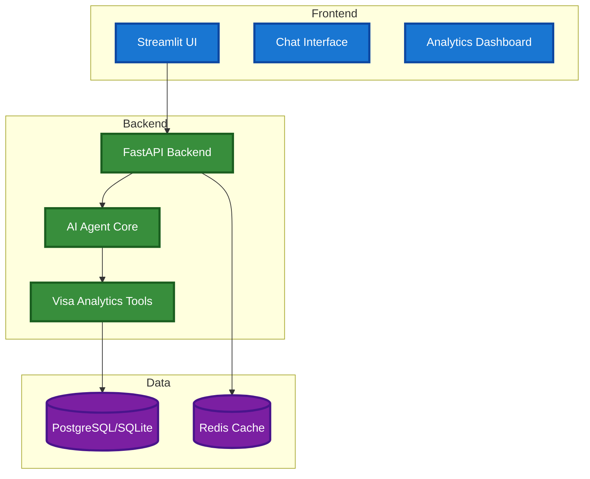

# 🤖 Visa Bulletin AI Agent


Containerized AI agent with REST API backend for US visa bulletin analysis and multi-provider LLM chat.

## ✨ Features

- 🔌 **Multiple LLM Provider Support**:
  - 🌐 Google Gemini (Free tier)
  - 💻 Ollama (Local, Free)
  - 🔷 OpenAI GPT (Paid)
  - 🟣 Anthropic Claude (Paid)

- 🎯 **Core Capabilities**:
  - 💬 Text-based chat interface with conversation memory
  - 🎯 Expert Mode Selection (General AI vs Visa Expert)
  - 📡 HTTP-based reliable communication protocol
  - ⚙️ Configurable system prompts and response timing metrics

- 📊 **US Visa Bulletin Analytics**:
  - 📈 Complete Employment-based category support (EB-1, EB-2, EB-3, EB-4, EB-5)
  - 👨‍👩‍👧‍👦 Complete Family-based category support (F1, F2A, F2B, F3, F4)
  - 🌍 Country-specific analysis (India, China, Mexico, Philippines, Worldwide)
  - 🤖 ML-powered forecasting using Random Forest and Logistic Regression
  - 📅 Historical trend analysis and date advancement predictions
  - 📋 Interactive dashboard with charts and visualizations

- 🏗️ **Architecture**:
  - 🐳 Full Docker containerization with microservices
  - ⚡ REST API with FastAPI backend
  - 📡 HTTP-based request/response communication
  - 🗄️ PostgreSQL database with Redis caching
  - 🏭 Factory pattern for agent creation
  - 📚 Layered architecture with clean separation

## 🚀 Quick Start

### 1. Clone and Setup
```bash
git clone <repository-url>
cd cisc691-a06
cp .env.example .env
```

### 2. Add API Keys to `.env`
```bash
# For Google Gemini (Free tier - recommended)
GOOGLE_API_KEY=your_google_api_key_here

# For OpenAI (if you have one)
OPENAI_API_KEY=your_openai_key_here

# For Anthropic (if you have one)  
ANTHROPIC_API_KEY=your_anthropic_key_here
```

### 3. Start Application
```bash
docker-compose up --build
```

### 4. Access Services
- **Frontend**: http://localhost:8501
- **API**: http://localhost:8000
- **API Docs**: http://localhost:8000/docs
- **Cache Stats**: http://localhost:8000/api/analytics/cache/stats
- **Health Check**: http://localhost:8000/health

### 5. (Optional) Setup Ollama for Local Models
```bash
# Install Ollama from https://ollama.com/download
ollama pull llama3.2

# Verify Ollama is running:
curl http://localhost:11434/api/tags
```

## 🐳 Docker Services

The application uses **microservices architecture** with 4 containers:

- **⚡ API Service** - FastAPI backend for REST API (port 8000)
- **💻 Web Service** - Streamlit frontend for user interface (port 8501)
- **🗄️ PostgreSQL Database** - Primary data storage with JSONB support (port 5432)
- **🔄 Redis Cache** - Caching layer for API performance (port 6379)

### Configuration
All configuration is handled through environment variables in `.env`:

#### LLM Providers
- **Google Gemini** (default, free tier)
- **OpenAI GPT** (paid)
- **Anthropic Claude** (paid)
- **Ollama** (local models via Docker)

#### Database
- **PostgreSQL** - Primary database for all data storage
- **Redis caching** (optional, degrades gracefully)
- Automatic schema creation and persistent volumes

## 🧪 Testing

### Run Tests
```bash
# Run all tests
pytest tests/ -v

# Run specific test categories
pytest tests/test_api_* -v        # API tests
pytest tests/test_*_caching.py -v # Caching tests
pytest tests/test_*_integration.py -v # Integration tests

# Run with coverage
pytest tests/ --cov=src --cov-report=html
```

### Test Categories
- **🔬 Unit Tests**: Individual component testing
- **🔗 Integration Tests**: End-to-end workflow testing
- **⚡ API Tests**: REST API endpoint testing
- **🔄 Cache Tests**: Redis caching functionality

### Manual Test Scripts
```bash
python scripts/test_agent.py      # Core agent functionality
python scripts/test_visa_agent.py # Visa bulletin expertise
```

## 🛠️ Troubleshooting

### Check Service Status
```bash
docker-compose ps
```

### View Logs
```bash
docker-compose logs api    # API logs
docker-compose logs web    # Web logs
docker-compose logs db     # Database logs
docker-compose logs redis  # Cache logs
```

### Restart Services
```bash
docker-compose restart     # Restart all
docker-compose down && docker-compose up --build  # Clean restart
```

## 📊 System Architecture & Documentation

For detailed technical documentation, see:
- **[📋 Workflow Diagrams](docs/workflow-diagrams.md)** - System architecture, agent workflows, data flow
- **[🤖 Detailed Features](docs/detailed-features.md)** - ML models, database architecture, visa expertise
- **[📊 Data Collection](docs/data-collection.md)** - Historical data collection, setup guides
- **[📡 WebSocket Analysis](docs/websocket-analysis.md)** - Analysis of real-time communication options and HTTP decision

### Quick Architecture Overview



## 📝 Project Information

This project was developed as part of the **CISC 691 - Foundations of Next-Gen AI** course assignment (A06: Building the AI Agent of Your Choice).

### Course Details
- **Institution**: Harrisburg University
- **Term**: Summer 2025
- **Professor**: Donald O'Hara

### Contributors
- Tien Dinh
- Kenneth Peter Fernandes

### Assignment Objectives
- Develop a functional AI agent using modern frameworks
- Implement multiple provider support for flexibility
- Create a modular and extensible architecture
- Demonstrate practical AI integration skills

---
*This project demonstrates the practical application of AI agent development concepts learned throughout the course.*