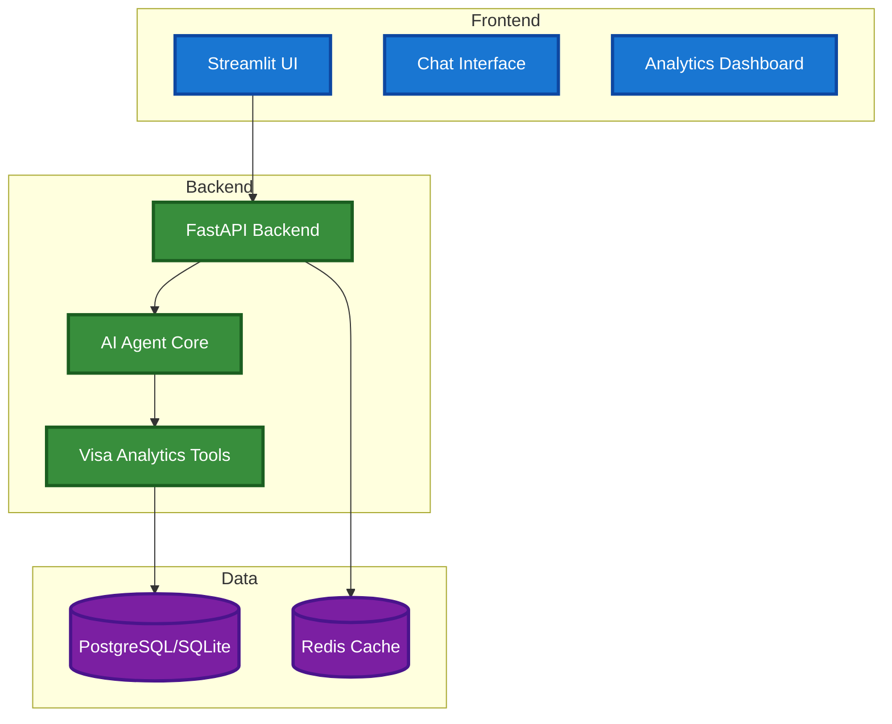

# 🤖 AgentVisa - AI Assistant for Visa Bulletin Insights


AgentVisa is a containerized AI assistant with REST API backend that provides intelligent US visa bulletin analysis and multi-provider LLM chat capabilities.

## ✨ Features

- 🔌 **Multiple LLM Provider Support**:
  - 🌐 Google Gemini (Free tier)
  - 💻 Ollama (Local, Free)
  - 🔷 OpenAI GPT (Paid)
  - 🟣 Anthropic Claude (Paid)

- 🎯 **Core Capabilities**:
  - 💬 Text-based chat interface with conversation memory
  - 🎯 Expert Mode Selection (General AI vs Visa Expert)
  - 📡 HTTP-based reliable communication protocol
  - ⚙️ Configurable system prompts and response timing metrics

- 📊 **US Visa Bulletin Analytics**:
  - 📈 Complete Employment-based category support (EB-1, EB-2, EB-3, EB-4, EB-5)
  - 👨‍👩‍👧‍👦 Complete Family-based category support (F1, F2A, F2B, F3, F4)
  - 🌍 Country-specific analysis (India, China, Mexico, Philippines, Worldwide)
  - 🤖 ML-powered forecasting using Random Forest and Logistic Regression
  - 📅 Historical trend analysis and date advancement predictions
  - 📋 Interactive dashboard with charts and visualizations

- 🏗️ **Architecture**:
  - 🐳 Full Docker containerization with microservices
  - ⚡ REST API with FastAPI backend
  - 📡 HTTP-based request/response communication
  - 🗄️ PostgreSQL database with Redis caching
  - 🏭 Factory pattern for agent creation
  - 📚 Layered architecture with clean separation

## 🚀 Quick Start

### Prerequisites
- [Docker Desktop](https://www.docker.com/products/docker-desktop/) running
- [Minikube](https://minikube.sigs.k8s.io/docs/start/) + [kubectl](https://kubernetes.io/docs/tasks/tools/) (for Kubernetes deployment)
- Git for cloning

### 🎯 Recommended: Kubernetes Deployment

```bash
# 1. Clone and setup
git clone <repository-url>
cd cisc691-a06

# 2. Start Minikube
minikube start --driver=docker

# 3. Deploy application
chmod +x k8s/deploy.sh
./k8s/deploy.sh

# 4. Access application
minikube service web -n visa-app
# This opens a tunnel and your browser automatically
# Use the tunnel URL shown (e.g., http://127.0.0.1:xxxxx)
# Keep the terminal with tunnel open while using the app
```

**🌐 Accessing Your Application:**
- **Tunnel URL**: Automatically opens in browser (recommended for macOS/Windows)
- **Direct IP**: `http://$(minikube ip):30080` (Linux/VM drivers only)
- **Port Forward**: `kubectl port-forward service/web 8501:8501 -n visa-app` (universal fallback)

**📖 For complete Kubernetes setup, troubleshooting, and platform-specific instructions:**
**→ See [docs/kubernetes-deployment.md](docs/kubernetes-deployment.md)**

### 🐳 Alternative: Docker Compose

```bash
# 1. Clone and setup
git clone <repository-url>
cd cisc691-a06
cp .env.example .env

# 2. Add your API keys to .env file
# GOOGLE_API_KEY=your_google_api_key_here

# 3. Start application
docker-compose up --build

# 4. Access services
# Web UI: http://localhost:8501
# API: http://localhost:8000
```

### 🗂️ Complete Workflow

| Step | Kubernetes | Docker Compose | Documentation |
|------|------------|----------------|---------------|
| **Setup** | `minikube start` | `cp .env.example .env` | [kubernetes-deployment.md](docs/kubernetes-deployment.md) |
| **Deploy** | `./k8s/deploy.sh` | `docker-compose up --build` | [detailed-features.md](docs/detailed-features.md) |
| **Access** | `minikube service web -n visa-app` (tunnel mode) | `http://localhost:8501` | [workflow-diagrams.md](docs/workflow-diagrams.md) |
| **Data Collection** | Execute in pod | Execute in container | [data-collection.md](docs/data-collection.md) |
| **Cleanup** | `./k8s/cleanup.sh` | `docker-compose down` | [kubernetes-deployment.md](docs/kubernetes-deployment.md) |

## 🐳 Docker Services

The application uses **microservices architecture** with 4 containers:

- **⚡ API Service** - FastAPI backend for REST API (port 8000)
- **💻 Web Service** - Streamlit frontend for user interface (port 8501)
- **🗄️ PostgreSQL Database** - Primary data storage with JSONB support (port 5432)
- **🔄 Redis Cache** - Caching layer for API performance (port 6379)

### Configuration
All configuration is handled through environment variables in `.env`:

#### LLM Providers
- **Google Gemini** (default, free tier)
- **OpenAI GPT** (paid)
- **Anthropic Claude** (paid)
- **Ollama** (local models via Docker)

#### Database
- **PostgreSQL** - Primary database for all data storage
- **Redis caching** (optional, degrades gracefully)
- Automatic schema creation and persistent volumes

## 🧪 Testing

### Run Tests
```bash
# Run all tests
pytest tests/ -v

# Run specific test categories
pytest tests/test_api_* -v        # API tests
pytest tests/test_*_caching.py -v # Caching tests
pytest tests/test_*_integration.py -v # Integration tests

# Run with coverage
pytest tests/ --cov=src --cov-report=html
```

### Test Categories
- **🔬 Unit Tests**: Individual component testing
- **🔗 Integration Tests**: End-to-end workflow testing
- **⚡ API Tests**: REST API endpoint testing
- **🔄 Cache Tests**: Redis caching functionality

### Manual Test Scripts
```bash
python scripts/test_agent.py      # Core agent functionality
python scripts/test_visa_agent.py # Visa bulletin expertise
```

## 🛠️ Troubleshooting

### Kubernetes/Minikube Issues

#### Cannot Access Application URLs
**If direct IP access doesn't work:**
- You're likely using Docker driver on macOS/Windows
- Use the tunnel method: `minikube service web -n visa-app`
- Keep the tunnel terminal open for consistent access

**If tunnel ports keep changing:**
- This is normal behavior for the tunnel
- Use port forwarding for consistent localhost access:
  ```bash
  kubectl port-forward service/web 8501:8501 -n visa-app
  ```

**If nothing works:**
```bash
# Check pod status
kubectl get pods -n visa-app

# Check service endpoints
kubectl get endpoints -n visa-app

# Check logs for errors
kubectl logs -f deployment/web -n visa-app
kubectl logs -f deployment/api -n visa-app

# Describe failing pods
kubectl describe pod <pod-name> -n visa-app
```

#### Deployment Issues
```bash
# Check Minikube status
minikube status

# Restart Minikube if needed
minikube stop
minikube start --driver=docker

# Redeploy application
./k8s/cleanup.sh
./k8s/deploy.sh
```

#### Manual Kubernetes Commands
If the automated script fails, deploy manually:
```bash
# Configure Docker environment
eval $(minikube docker-env)

# Build images
docker build -f Dockerfile.api -t visa-app-api:latest .
docker build -f Dockerfile.web -t visa-app-web:latest .

# Deploy resources
kubectl apply -f k8s/namespace.yaml
kubectl apply -f k8s/secrets/app-secrets.yaml
kubectl apply -f k8s/configmaps/app-config.yaml
kubectl apply -f k8s/volumes/
kubectl apply -f k8s/deployments/postgres.yaml
kubectl apply -f k8s/services/postgres-service.yaml
kubectl apply -f k8s/deployments/redis.yaml
kubectl apply -f k8s/services/redis-service.yaml

# Wait for database
kubectl wait --for=condition=ready pod -l app=postgres -n visa-app --timeout=300s

# Deploy application
kubectl apply -f k8s/deployments/api.yaml
kubectl apply -f k8s/services/api-service.yaml
kubectl apply -f k8s/deployments/web.yaml
kubectl apply -f k8s/services/web-service.yaml
```

### Docker Compose Issues

#### Check Service Status
```bash
docker-compose ps
```

#### View Logs
```bash
docker-compose logs api    # API logs
docker-compose logs web    # Web logs
docker-compose logs db     # Database logs
docker-compose logs redis  # Cache logs
```

#### Restart Services
```bash
docker-compose restart     # Restart all
docker-compose down && docker-compose up --build  # Clean restart
```

## 📊 System Architecture & Documentation

For detailed technical documentation, see:
- **[🚀 Kubernetes Deployment](docs/kubernetes-deployment.md)** - Complete K8s setup, troubleshooting, platform-specific instructions
- **[📋 Workflow Diagrams](docs/workflow-diagrams.md)** - System architecture, agent workflows, data flow
- **[🤖 Detailed Features](docs/detailed-features.md)** - ML models, database architecture, visa expertise
- **[📊 Data Collection](docs/data-collection.md)** - Historical data collection, setup guides
- **[📡 WebSocket Analysis](docs/websocket-analysis.md)** - Analysis of real-time communication options and HTTP decision

### Quick Architecture Overview



## 📝 Project Information

This project was developed as part of the **CISC 691 - Foundations of Next-Gen AI** course assignment (A06: Building the AI Agent of Your Choice).

### Course Details
- **Institution**: Harrisburg University
- **Term**: Summer 2025
- **Professor**: Donald O'Hara

### Contributors
- Tien Dinh
- Kenneth Peter Fernandes

### Assignment Objectives
- Develop a functional AI agent using modern frameworks
- Implement multiple provider support for flexibility
- Create a modular and extensible architecture
- Demonstrate practical AI integration skills

---
*This project demonstrates the practical application of AI agent development concepts learned throughout the course.*