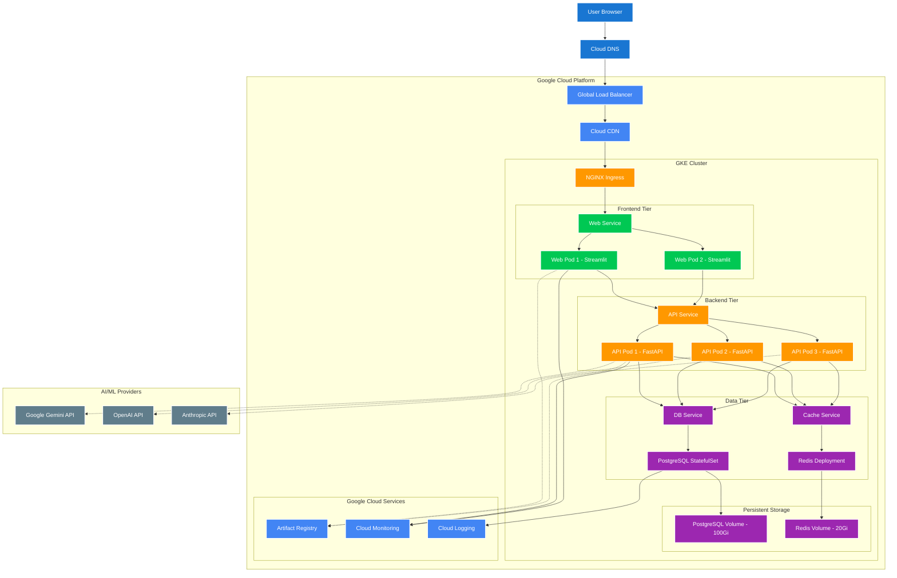

# AgentVisa GKE Architecture Diagram

## Complete User-to-Application Flow on Google Kubernetes Engine



## 🌊 **Request Flow Breakdown**

### **1. User Request Journey**
```
👤 User (Browser) 
    ↓ DNS Resolution
🌐 Cloud DNS (agentvisa.example.com → Load Balancer IP)
    ↓ HTTPS Request
⚡ Cloud Load Balancer (Global, SSL Termination)
    ↓ Content Check
☁️ Cloud CDN (Static Assets Cached)
    ↓ Route to GKE
🚪 NGINX Ingress Controller (Traffic Routing)
    ↓ Service Discovery
🔗 Web Service (LoadBalancer)
    ↓ Pod Selection
💻 Streamlit Web Pod (UI Rendering)
```

### **2. API Communication Flow**
```
💻 Web Pod (User Interaction)
    ↓ HTTP Request
🔗 API Service (Internal ClusterIP)
    ↓ Load Balancing
🚀 FastAPI Pod (Business Logic)
    ↓ Database Query
🔗 PostgreSQL Service
    ↓ Data Storage
🐘 PostgreSQL StatefulSet
    ↓ Persistent Volume
📀 GKE Persistent Disk (100Gi SSD)
```

### **3. AI/ML Integration Flow**
```
🚀 API Pod (Agent Request)
    ↓ External API Call
🌐 Google Gemini API (Primary LLM)
    ↓ Fallback Options
💻 OpenAI / 🟣 Anthropic APIs
    ↓ Local Option
🏠 Ollama (Self-hosted in cluster)
    ↓ Response
🚀 API Pod (Response Processing)
    ↓ Cache Storage
🔄 Redis (Performance)
```

## 🏗️ **Infrastructure Components**

### **Compute Resources**
- **GKE Cluster**: Cost-optimized zonal cluster with preemptible nodes (e2-medium instances)
- **Web Pods**: 1-2 replicas (512Mi-1Gi RAM, 200m-500m CPU)
- **API Pods**: 1-2 replicas (512Mi-1Gi RAM, 250m-500m CPU) 
- **Database**: PostgreSQL StatefulSet (1Gi-2Gi RAM, 250m-500m CPU)
- **Cache**: Redis Deployment (256Mi-512Mi RAM, 100m-200m CPU)

### **Network & Security**
- **Load Balancer**: HTTP(S) Load Balancer with managed SSL certificates
- **Services**: LoadBalancer (external) + ClusterIP (internal)
- **Workload Identity**: Secure GCP service authentication
- **Secrets Management**: Kubernetes secrets for API keys and credentials

### **Storage & Persistence**
- **PostgreSQL**: 45Gi Standard persistent disk (cost-optimized)
- **Redis**: 20Gi Standard persistent disk
- **Container Images**: Google Artifact Registry (agentvisa repository)
- **Configuration**: ConfigMaps and Secrets

### **Monitoring & Observability**
- **Minimal Monitoring**: System components only (cost-optimized)
- **Logging**: System components logging to reduce costs
- **Health Checks**: Kubernetes liveness/readiness probes
- **Container Health**: Built-in Kubernetes health monitoring

## 🔄 **High Availability Features**

### **Application Layer**
- **Multi-replica deployments** (1-2 Web, 1-2 API pods with HPA)
- **Rolling updates** with zero downtime
- **Horizontal Pod Autoscaling** based on CPU utilization (min=1, max=2)
- **Preemptible nodes** for cost optimization (60-80% savings)

### **Data Layer** 
- **StatefulSet** for PostgreSQL with persistent storage
- **Redis clustering** for cache high availability
- **Backup automation** for data persistence
- **Point-in-time recovery** capabilities

### **Network Layer**
- **Global load balancing** with health checks
- **Multi-zone deployment** for fault tolerance
- **CDN caching** for static content delivery
- **SSL/TLS termination** at load balancer

## 🚀 **Scaling Strategy**

### **Horizontal Scaling**
```bash
# Scale API pods based on load
kubectl scale deployment api -n visa-app --replicas=5

# Auto-scaling configuration
kubectl autoscale deployment api -n visa-app --min=2 --max=10 --cpu-percent=70
```

### **Vertical Scaling**
```bash
# Increase resource limits for high-traffic periods
kubectl patch deployment api -n visa-app -p '{"spec":{"template":{"spec":{"containers":[{"name":"api","resources":{"limits":{"memory":"2Gi","cpu":"1000m"}}}]}}}}'
```

This architecture provides enterprise-grade scalability, reliability, and performance for your AgentVisa application on Google Kubernetes Engine.