# Data Flow Architecture

## Overview
This document provides comprehensive diagrams and documentation of how the AgentVisa AI system processes visa bulletin data, integrates with multiple LLM providers, and delivers intelligent visa analytics through a modern microservices architecture.

## Simplified Data Flow

```mermaid
flowchart LR
    A[🌐 State Dept Website] --> B[📥 Web Scraper & Parser]
    B --> C[🔍 Data Validator]
    C --> D[💾 PostgreSQL/SQLite]
    D --> E[🤖 AI Agent System]
    E --> F[📱 Streamlit UI]
    D --> G[🔌 REST API]
    D --> H[📊 Analytics Engine]
    
    classDef source fill:#e3f2fd
    classDef process fill:#f3e5f5
    classDef storage fill:#e8f5e8
    classDef ai fill:#fce4ec
    classDef app fill:#fff3e0
    
    class A source
    class B,C,H process
    class D storage
    class E ai
    class F,G app
```

## Detailed System Architecture & Data Flow

## Component Details

### 1. Data Sources & Entry Points

**External Source:**
- `travel.state.gov` - US State Department visa bulletin website
- Provides both current and historical bulletin data

**Entry Points:**
- **MonthlyDataFetcher** (`src/visa/collection/monthly.py:20`): Automated monthly collection
- **HistoricalDataCollector** (`src/visa/collection/historical.py:19`): Bulk historical data collection
- **Manual Fetch**: Direct parser usage

### 2. Web Scraping Layer

**VisaBulletinScraper** (`src/visa/parser.py:36`):
- Handles HTTP requests with proper headers
- Manages URL discovery and generation
- Provides URL verification functionality

**Key Methods:**
- `get_current_bulletin_url()` (`src/visa/parser.py:50`): Discovers current bulletin URL
- `generate_historical_bulletin_url()` (`src/visa/parser.py:85`): Creates historical URLs
- `fetch_bulletin_content()` (`src/visa/parser.py:74`): Retrieves HTML content

### 3. Content Parsing Pipeline

**BulletinDateExtractor** (`src/visa/parser.py:123`):
- Extracts bulletin dates from URLs and content
- Calculates fiscal years
- Handles multiple date formats

**BulletinTableParser** (`src/visa/parser.py:203`):
- Identifies visa-related HTML tables
- Parses employment-based (EB-1 to EB-5) and family-based (F1-F4) categories
- Extracts country-specific data (China, India, Mexico, Philippines, Worldwide)
- Handles various date formats (State Dept format: 15JAN23, numeric formats)

### 4. Data Model Creation

**VisaBulletin** (`src/visa/models.py:88`): Main bulletin container
**CategoryData** (`src/visa/models.py:45`): Individual category/country data
**Enums:**
- `VisaCategory` (`src/visa/models.py:11`): EB-1 through EB-5, F1-F4
- `CountryCode` (`src/visa/models.py:28`): Supported countries
- `BulletinStatus` (`src/visa/models.py:37`): Current, Unavailable, Date Specified

### 5. Validation & Storage

**BulletinValidator** (`src/visa/validators.py`):
- Validates bulletin structure and data integrity
- Checks date consistency and category completeness

**VisaBulletinRepository** (`src/visa/repository.py:16`):
- High-level CRUD operations
- Bulk import functionality
- Data cleaning and transformation

**VisaDatabase** (`src/visa/database.py`):
- SQLite database operations
- Schema management
- Data persistence

### 6. Configuration & Status

**VisaConfig** (`src/visa/config.py:10`):
- State Department URLs
- Supported categories and countries
- Database and caching settings

**Status Tracking:**
- `monthly_fetch_status.json`: Monthly fetch statistics
- `collection.log`: Detailed operation logs
- Database statistics and health checks

## Data Flow Patterns

### Monthly Collection Flow
1. **Scheduler/Cron** triggers `MonthlyDataFetcher`
2. **URL Discovery** finds current bulletin
3. **Content Parsing** extracts data
4. **Validation** ensures data quality
5. **Storage** saves to SQLite database
6. **Status Update** logs success/failure

### Historical Collection Flow
1. **Date Range** specified (e.g., 2020-2025)
2. **URL Generation** creates historical URLs
3. **Parallel Processing** fetches multiple bulletins
4. **Bulk Import** stores all valid data
5. **Progress Tracking** logs completion status

### Error Handling
- **Network Errors**: Retry logic with exponential backoff
- **Parsing Errors**: Skip invalid entries, log warnings
- **Validation Errors**: Detailed error reporting
- **Database Errors**: Transaction rollback, data integrity

## Application Integration

The stored data is consumed by:
- **Streamlit UI** (`src/ui/`): User interface for predictions
- **FastAPI Endpoints** (`src/api/`): REST API for external access
- **Analytics Dashboard**: Historical trend analysis
- **Prediction Engine** (`src/visa/predictor.py`): ML-based forecasting

## Performance Characteristics

- **Concurrent Processing**: Up to 5 parallel workers for historical collection
- **Caching**: 24-hour cache duration for frequently accessed data
- **Database**: SQLite for simplicity, PostgreSQL support available
- **Validation**: Comprehensive data quality checks
- **Monitoring**: Detailed logging and status tracking