# Workflow Diagram Documentation

## System Architecture Overview

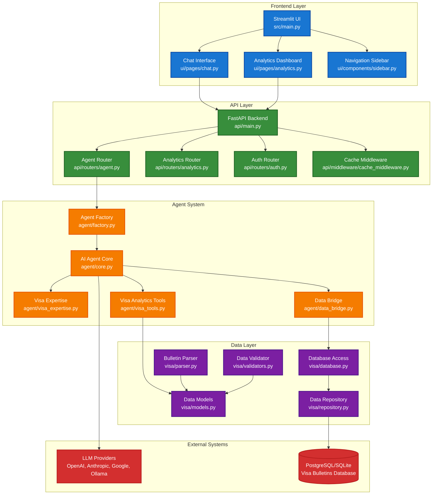

## Agent Decision-Making Process

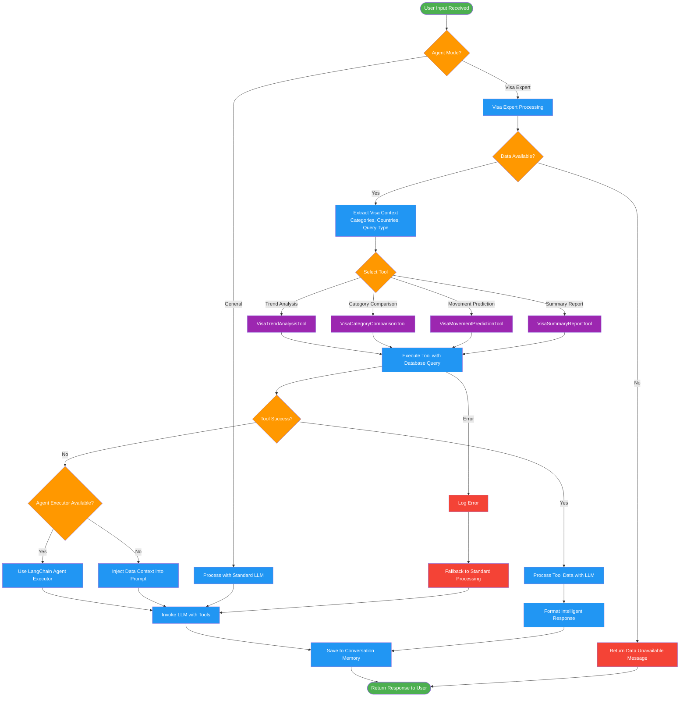

## Data Flow Sequence Diagram

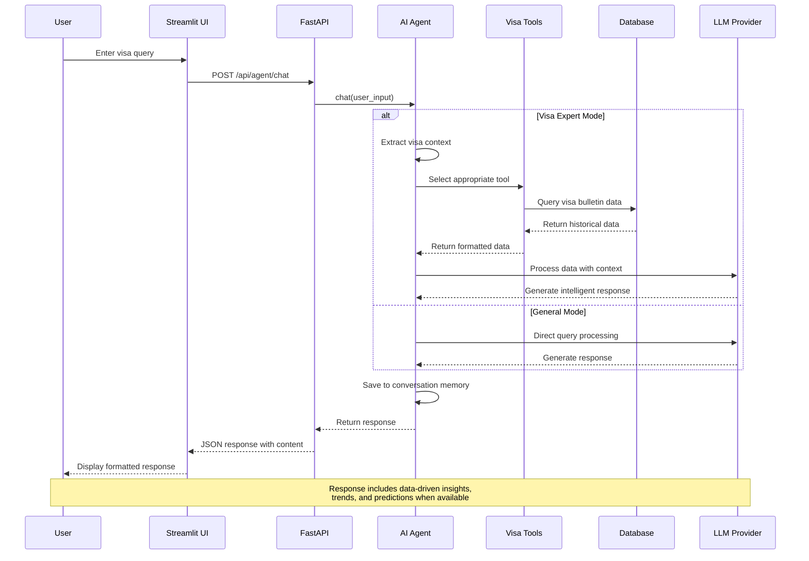

## User Interaction Flow

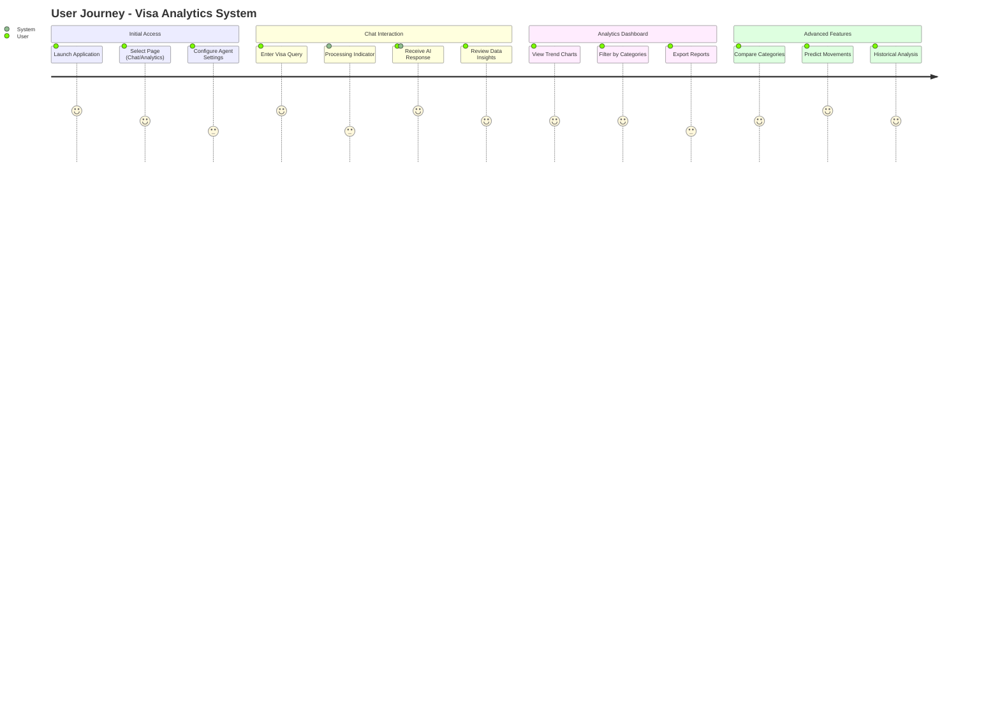

## Component Interaction Matrix

| Component | Streamlit UI | FastAPI | Agent Core | Visa Tools | Database |
|-----------|--------------|---------|------------|------------|----------|
| **Streamlit UI** | ✓ | HTTP REST | - | - | - |
| **FastAPI** | CORS/JSON | ✓ | Direct Call | - | - |
| **Agent Core** | - | Response | ✓ | Tool Integration | Via Tools |
| **Visa Tools** | - | - | Data Provider | ✓ | SQL Queries |
| **Database** | - | - | - | Data Storage | ✓ |

## Technology Stack Overview

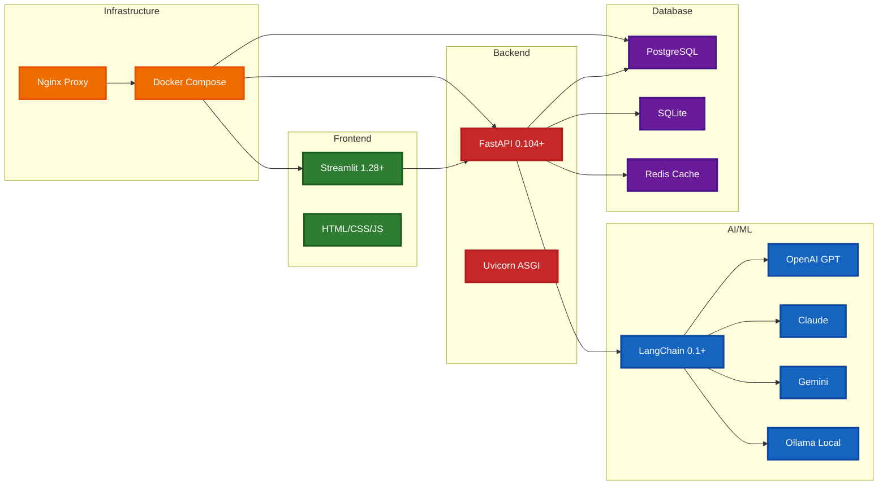

## Database Schema Visualization

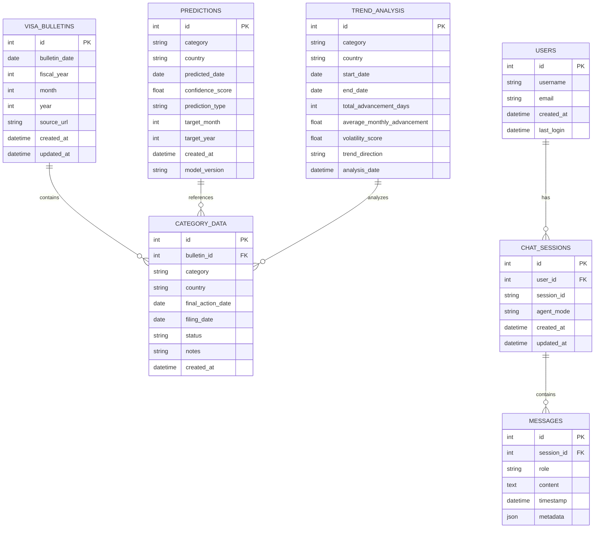

## File Structure Overview

```
cisc691-a06/
├── src/
│   ├── main.py                 # Streamlit entry point
│   ├── agent/                  # AI Agent system
│   │   ├── core.py            # Main agent logic
│   │   ├── factory.py         # Agent creation
│   │   ├── visa_expertise.py  # Domain knowledge
│   │   ├── visa_tools.py      # Analytics tools
│   │   └── data_bridge.py     # Data integration
│   ├── api/                   # FastAPI backend
│   │   ├── main.py           # API entry point
│   │   ├── routers/          # HTTP endpoints
│   │   ├── models/           # API data models
│   │   ├── middleware/       # Request processing
│   │   └── utils/            # API utilities
│   ├── ui/                   # Streamlit frontend
│   │   ├── pages/            # UI pages
│   │   ├── components/       # Reusable components
│   │   └── utils/            # Frontend utilities
│   ├── visa/                 # Domain logic
│   │   ├── models.py         # Core data models
│   │   ├── database.py       # Database access
│   │   ├── repository.py     # Data operations
│   │   ├── parser.py         # Bulletin parsing
│   │   ├── validators.py     # Data validation
│   │   ├── analytics.py      # Analysis engine
│   │   └── collection/       # Data collection
│   └── utils/                # Shared utilities
├── tests/                    # Test suite
├── docs/                     # Documentation
├── data/                     # Application data
├── docker/                   # Docker configuration
└── scripts/                  # Utility scripts
```

## Docker Architecture Overview

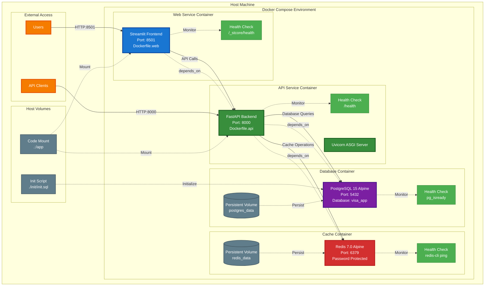

## Container Communication Flow

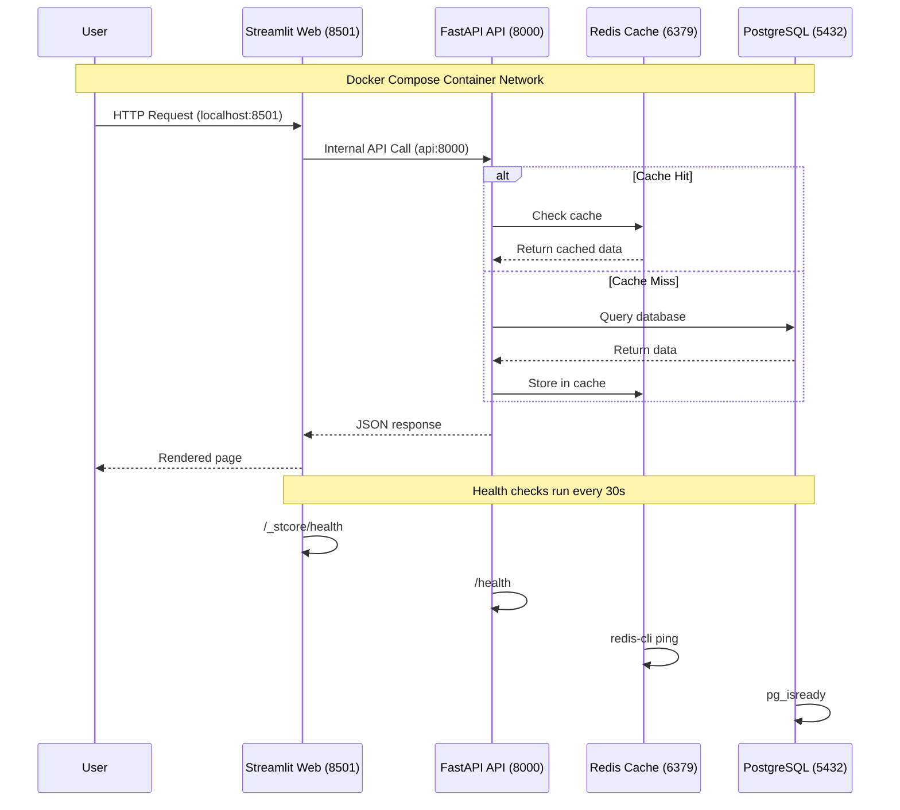

## Docker Service Configuration

| Service | Image | Port | Dependencies | Health Check | Volumes |
|---------|-------|------|--------------|--------------|---------|
| **web** | Custom (Dockerfile.web) | 8501 | api | /_stcore/health | Code mount |
| **api** | Custom (Dockerfile.api) | 8000 | db, redis | /health | Code mount |
| **db** | postgres:15-alpine | 5432 | - | pg_isready | postgres_data, init.sql |
| **redis** | redis:7.0-alpine | 6379 | - | redis-cli ping | redis_data |

## Environment Variables

```bash
# Database Configuration
DATABASE_URL=postgresql://admin:password@db:5432/visa_app
POSTGRES_USER=admin
POSTGRES_PASSWORD=password
POSTGRES_DB=visa_app

# Redis Configuration
REDIS_HOST=redis
REDIS_PORT=6379
REDIS_PASSWORD=redis_password

# Application Configuration
DOCKER_MODE=true
PYTHONPATH=/app/src
API_BASE_URL=http://api:8000
```

## Kubernetes Architecture Overview

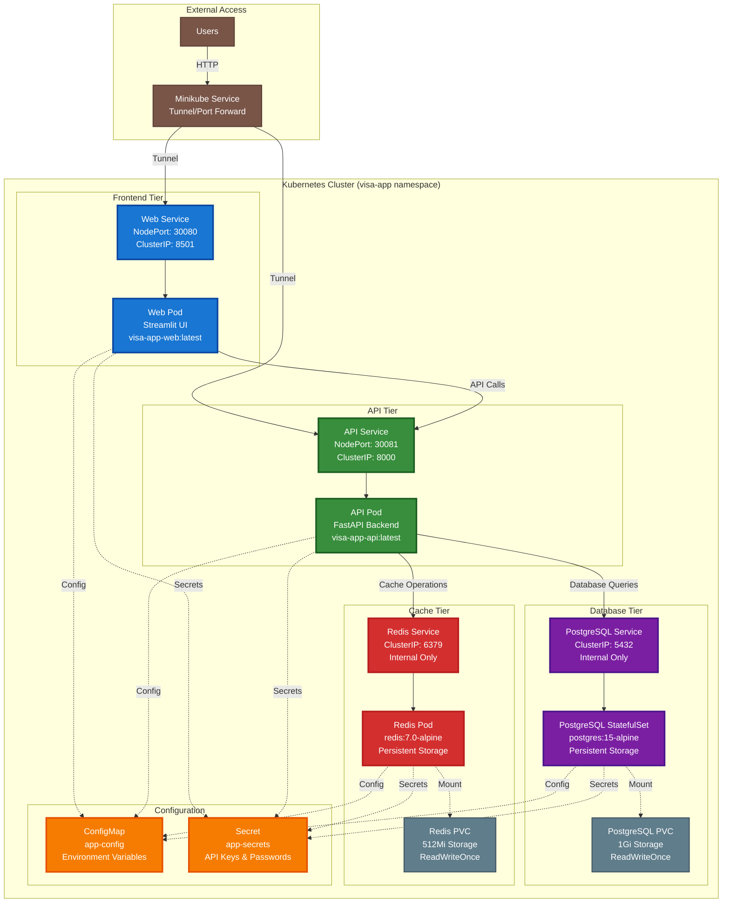

## Kubernetes Deployment Flow

```mermaid
flowchart TD
    START([Start Deployment]) --> MINIKUBE_CHECK{Minikube Running?}
    MINIKUBE_CHECK -->|No| START_MINIKUBE[minikube start]
    MINIKUBE_CHECK -->|Yes| DOCKER_ENV[eval $(minikube docker-env)]
    START_MINIKUBE --> DOCKER_ENV
    
    DOCKER_ENV --> BUILD_IMAGES[Build Docker Images]
    BUILD_IMAGES --> BUILD_API[docker build -f Dockerfile.api -t visa-app-api:latest .]
    BUILD_IMAGES --> BUILD_WEB[docker build -f Dockerfile.web -t visa-app-web:latest .]
    
    BUILD_API --> DEPLOY_INFRA[Deploy Infrastructure]
    BUILD_WEB --> DEPLOY_INFRA
    
    DEPLOY_INFRA --> CREATE_NS[kubectl apply -f k8s/namespace.yaml]
    CREATE_NS --> DEPLOY_SECRETS[kubectl apply -f k8s/secrets/]
    DEPLOY_SECRETS --> DEPLOY_CONFIG[kubectl apply -f k8s/configmaps/]
    DEPLOY_CONFIG --> DEPLOY_STORAGE[kubectl apply -f k8s/volumes/]
    
    DEPLOY_STORAGE --> DEPLOY_DB[Deploy Database Layer]
    DEPLOY_DB --> PG_DEPLOY[kubectl apply -f k8s/deployments/postgres.yaml]
    PG_DEPLOY --> PG_SERVICE[kubectl apply -f k8s/services/postgres-service.yaml]
    PG_SERVICE --> PG_WAIT[kubectl wait --for=condition=ready pod -l app=postgres]
    
    PG_WAIT --> DEPLOY_CACHE[Deploy Cache Layer]
    DEPLOY_CACHE --> REDIS_DEPLOY[kubectl apply -f k8s/deployments/redis.yaml]
    REDIS_DEPLOY --> REDIS_SERVICE[kubectl apply -f k8s/services/redis-service.yaml]
    REDIS_SERVICE --> REDIS_WAIT[kubectl wait --for=condition=ready pod -l app=redis]
    
    REDIS_WAIT --> DEPLOY_APP[Deploy Application Layer]
    DEPLOY_APP --> API_DEPLOY[kubectl apply -f k8s/deployments/api.yaml]
    API_DEPLOY --> API_SERVICE[kubectl apply -f k8s/services/api-service.yaml]
    API_SERVICE --> API_WAIT[kubectl wait --for=condition=ready pod -l app=api]
    
    API_WAIT --> WEB_DEPLOY[kubectl apply -f k8s/deployments/web.yaml]
    WEB_DEPLOY --> WEB_SERVICE[kubectl apply -f k8s/services/web-service.yaml]
    WEB_SERVICE --> WEB_WAIT[kubectl wait --for=condition=ready pod -l app=web]
    
    WEB_WAIT --> VERIFY[Verify Deployment]
    VERIFY --> CHECK_PODS[kubectl get pods -n visa-app]
    CHECK_PODS --> CHECK_SERVICES[kubectl get services -n visa-app]
    CHECK_SERVICES --> ACCESS_APP[minikube service web -n visa-app]
    ACCESS_APP --> END([Deployment Complete])
    
    %% Error handling
    PG_WAIT -->|Timeout| PG_DEBUG[Check PostgreSQL logs]
    REDIS_WAIT -->|Timeout| REDIS_DEBUG[Check Redis logs]
    API_WAIT -->|Timeout| API_DEBUG[Check API logs]
    WEB_WAIT -->|Timeout| WEB_DEBUG[Check Web logs]
    
    PG_DEBUG --> END
    REDIS_DEBUG --> END
    API_DEBUG --> END
    WEB_DEBUG --> END
    
    %% Styling
    classDef startEnd fill:#4caf50,color:white
    classDef process fill:#2196f3,color:white
    classDef decision fill:#ff9800,color:white
    classDef deploy fill:#9c27b0,color:white
    classDef error fill:#f44336,color:white
    
    class START,END startEnd
    class MINIKUBE_CHECK decision
    class START_MINIKUBE,DOCKER_ENV,BUILD_IMAGES,BUILD_API,BUILD_WEB,VERIFY,CHECK_PODS,CHECK_SERVICES,ACCESS_APP process
    class DEPLOY_INFRA,CREATE_NS,DEPLOY_SECRETS,DEPLOY_CONFIG,DEPLOY_STORAGE,DEPLOY_DB,PG_DEPLOY,PG_SERVICE,DEPLOY_CACHE,REDIS_DEPLOY,REDIS_SERVICE,DEPLOY_APP,API_DEPLOY,API_SERVICE,WEB_DEPLOY,WEB_SERVICE deploy
    class PG_WAIT,REDIS_WAIT,API_WAIT,WEB_WAIT,PG_DEBUG,REDIS_DEBUG,API_DEBUG,WEB_DEBUG error
```

## Kubernetes Resource Hierarchy

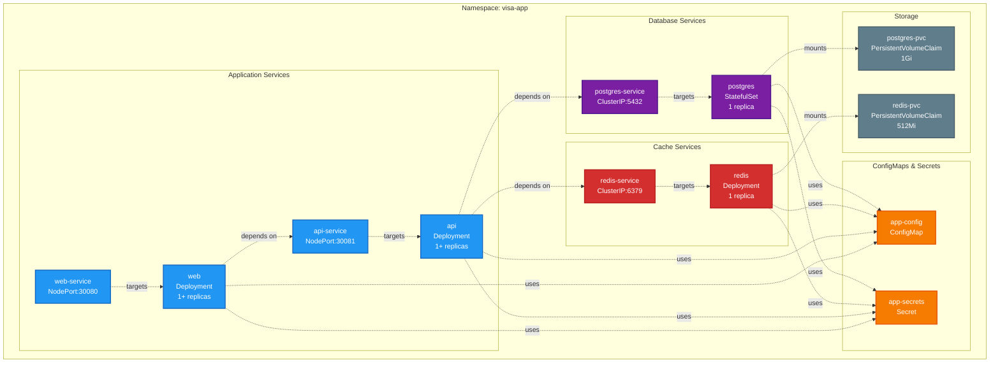

## Kubernetes Access Patterns

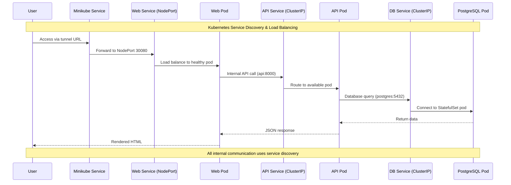

## Kubernetes Resource Configuration

| Resource Type | Name | Replicas | Storage | Ports | Access |
|---------------|------|----------|---------|-------|---------|
| **StatefulSet** | postgres | 1 | 1Gi PVC | 5432 | ClusterIP |
| **Deployment** | redis | 1 | 512Mi PVC | 6379 | ClusterIP |
| **Deployment** | api | 1+ | - | 8000 | NodePort:30081 |
| **Deployment** | web | 1+ | - | 8501 | NodePort:30080 |
| **Service** | postgres-service | - | - | 5432 | ClusterIP |
| **Service** | redis-service | - | - | 6379 | ClusterIP |
| **Service** | api-service | - | - | 8000→30081 | NodePort |
| **Service** | web-service | - | - | 8501→30080 | NodePort |

---

*Generated with Claude Code - Professional Technical Documentation for Academic Submission*