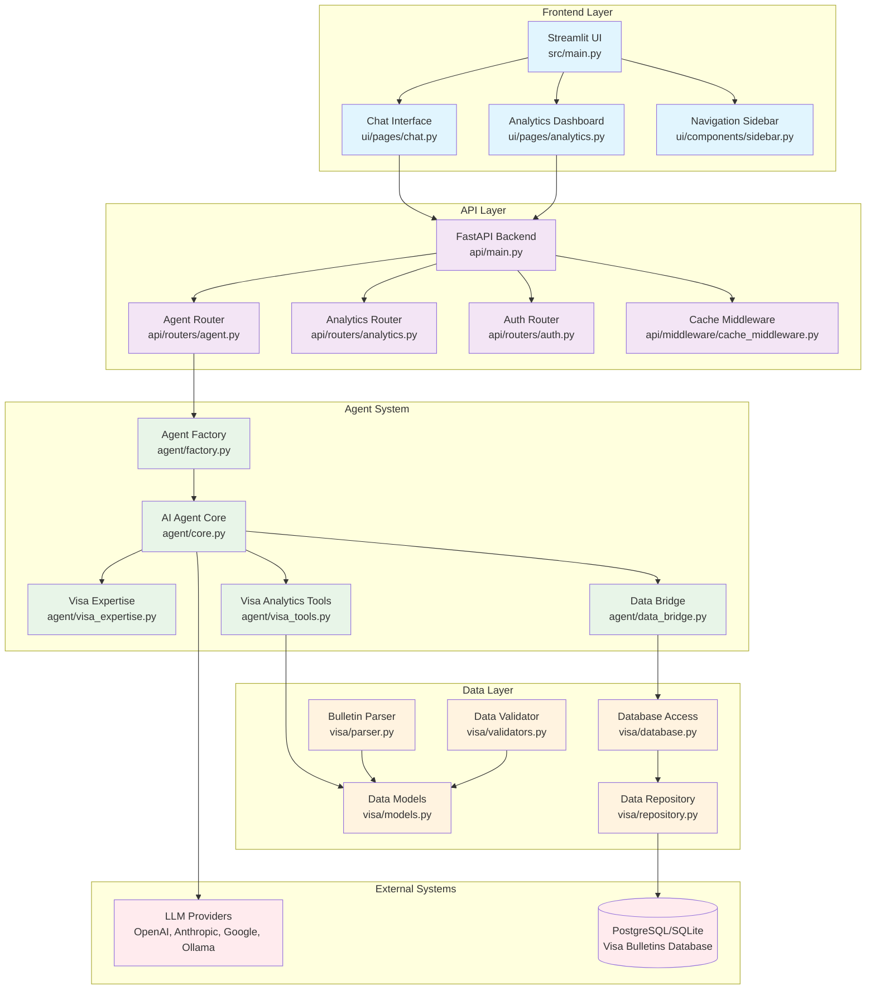
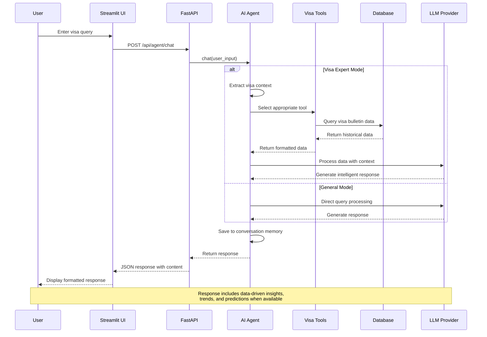
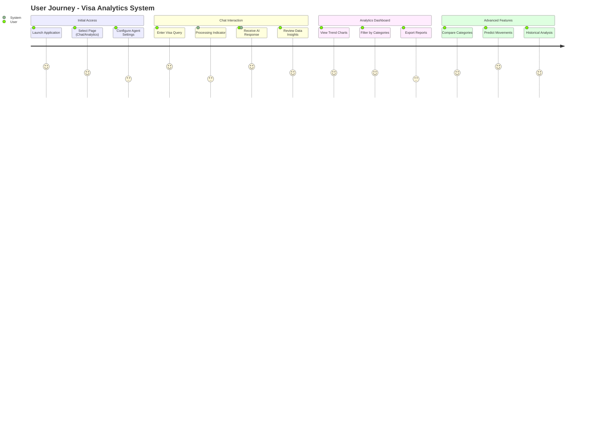
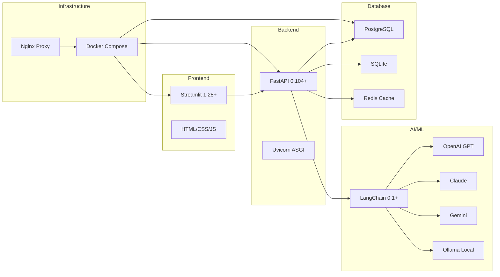
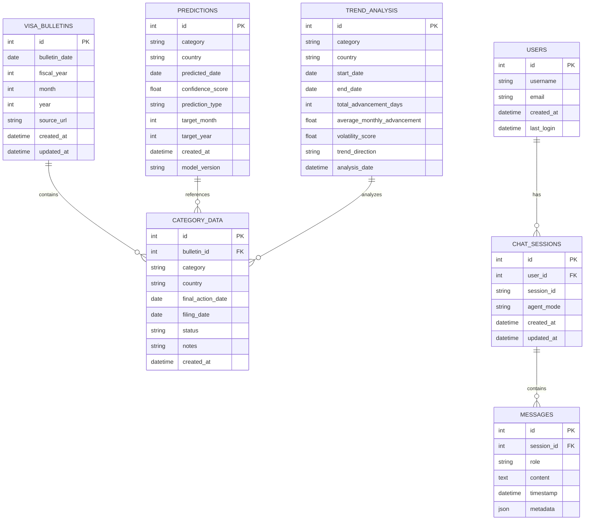

# Workflow Diagram Documentation

## System Architecture Overview



## Agent Decision-Making Process


## Data Flow Sequence Diagram



## User Interaction Flow



## Component Interaction Matrix

| Component | Streamlit UI | FastAPI | Agent Core | Visa Tools | Database |
|-----------|--------------|---------|------------|------------|----------|
| **Streamlit UI** | ✓ | HTTP REST | - | - | - |
| **FastAPI** | CORS/JSON | ✓ | Direct Call | - | - |
| **Agent Core** | - | Response | ✓ | Tool Integration | Via Tools |
| **Visa Tools** | - | - | Data Provider | ✓ | SQL Queries |
| **Database** | - | - | - | Data Storage | ✓ |

## Technology Stack Overview



## Database Schema Visualization



## File Structure Overview

```
cisc691-a06/
├── src/
│   ├── main.py                 # Streamlit entry point
│   ├── agent/                  # AI Agent system
│   │   ├── core.py            # Main agent logic
│   │   ├── factory.py         # Agent creation
│   │   ├── visa_expertise.py  # Domain knowledge
│   │   ├── visa_tools.py      # Analytics tools
│   │   └── data_bridge.py     # Data integration
│   ├── api/                   # FastAPI backend
│   │   ├── main.py           # API entry point
│   │   ├── routers/          # HTTP endpoints
│   │   ├── models/           # API data models
│   │   ├── middleware/       # Request processing
│   │   └── utils/            # API utilities
│   ├── ui/                   # Streamlit frontend
│   │   ├── pages/            # UI pages
│   │   ├── components/       # Reusable components
│   │   └── utils/            # Frontend utilities
│   ├── visa/                 # Domain logic
│   │   ├── models.py         # Core data models
│   │   ├── database.py       # Database access
│   │   ├── repository.py     # Data operations
│   │   ├── parser.py         # Bulletin parsing
│   │   ├── validators.py     # Data validation
│   │   ├── analytics.py      # Analysis engine
│   │   └── collection/       # Data collection
│   └── utils/                # Shared utilities
├── tests/                    # Test suite
├── docs/                     # Documentation
├── data/                     # Application data
├── docker/                   # Docker configuration
└── scripts/                  # Utility scripts
```

---

*Generated with Claude Code - Professional Technical Documentation for Academic Submission*